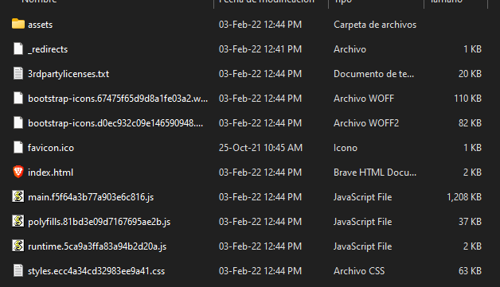

# Proyecto final: Tienda Virtual - Desarrollo Asistido por Software


Tienda online (ecommerce) que ofrece productos de tecnología bajo pedido con pago exclusivamente en línea por paypal y terjeta de crédito/débito que cuenta con envío Nacional. El proyecto comprende de dos aplicaciones una web(tienda) y una de escritorio(administración) y han sido desarrolladas con el framework Angular y C# respectivamente.

Cotenidos
=================
- [Cotenidos](#cotenidos)
	- [Software requerido](#software-requerido)
	- [Instalación](#instalación)
		- [Despliegue estándar](#despliegue-estándar)
		- [Despliegue personalizado](#despliegue-personalizado)
	- [Seguridad](#información-en-firebase)
		- [Obtención de tokens OAuth2.0](#obtención-de-tokens-oauth20)
	- [Documentación](#documentación)
		- [Swagger](#documentación-de-usuario)
		- [Postman](#documentación-api)
	- [Bitácora](#bitácora)
	- [Autores](#autores)


## Software requerido
- NodeJS v14.17.4
- AngularCli v12.2.0
- TypeScript v4.3.5
- Visual Studio Comunity

## Instalación

## Despliege estándar
En el despliegue estándar se desplegará el sitio con las configuraciones de la cuenta firebase y paypal existentes en el proyecto de igual manera la aplicación de administración en el escritorio.
1. Descargar los archivos de la carpeta dist de la aplicación web

2. Subir la carpeta "dist" a un hosting a libre elección 


3. Descargar el ejecutable(caprta con nombre "Instalador AdmiTienda") de la aplicación de escritorio e instalar la aplicación

	
	

4. Ejecutar el programa y verificar que funcione con las credenciales dadas por el desarrollador

	
	

5. Comprobar el funcionamiento del sitio

	

6. La administración de la base de datos en firebase estará a cargo del portador de la cuenta de firebase - firestore


## Despliegue personalizado

En el despliegue personalizado se desplegará un sitio web con las configuraciones de una nueva cuenta firebase y de paypal de igual manera la aplicación de administración en el escritorio. 

**Se requiere de las credenciales de una aplicación firebase - firestore y de las credenciales de paypal. Se deberá además habilitar la autenticación con google, facebook y correo electrónico en firebase antes de continuar con el despliegue**

1. Descargar el código fuente de las aplicaciones(appTienda, AdmiTienda)

	

2. Abrir la carpeta de la aplicación web (Tienda) en el cmd
e instalar las dependencias del proyecto con el comando:
```bash
cd /ruta-de-la-aplicación-web/ > npm install
```
3. Sustituir las credenciales en el archivo "environments/environment.prod.ts" en la constante environment el campo "firebaseConfig" con las nuevas credenciales, y sustiuir el campo "clientId" con la credencial dada por paypal

	

4. Generar la nueva aplicación web ejecutando el comando:

```bash
cd /ruta-de-la-aplicación-web/ > ng build 
```
	Luego de esto se agregará una carpeta llamada "dist" al proyecto, es la carpeta que se deberá subir al hosting 

5. De igual manera sustituir las credenciales en el archivo de la aplicación de escritorio llamada "apptienda.json"

	

6. Generar el archivo ejecutable, recompilando el proyecto (clic derecho en el proyecto y en recompilar) y publicandolo en un carpeta que se la pueda localizar(clic derecho y publicar)

	


7. Agregar un usuario administrador desde firebase en una colección llamada "Administradores" con los siguientes atributos:

	

8. Proceder con los [pasos 2, 4 y 5 del despliegue estándar](#despliegue-estándar). Luego ejecutar el programa administrador con las credenciales del administrador creadas previamente. A partir de este momento puede crear productos y publicarlos en la tienda


## Manejo de la información en firebase

- Al crear nuevos productos automáticamente se creará la colección de "Productos" en la base de datos firebase - firestore, de igual manera se creará desde la aplicación web los pedidos que los usuarios realicen.

- Cada registro de los usuarios en la página web se mostrará en el apartado de autenticación de firebase - fireauth 

- Los usuarios pueden recuperar las contraseñas de forma segura graciás a los servicios web de firebase


## Documentación

### Manuales de Usuario

- Manual de la aplicación [web para usuarios (clientes)](https://github.com/MarlonMaisanche/DesarrolloAsistido/blob/dev/Inf_Tien_Online.pdf)

- Manual de la aplicación de [escritorio para usuarios (administradores)](https://github.com/MarlonMaisanche/DesarrolloAsistido/blob/dev/MANUAL%20DE%20USUARIO.pdf)

### Documentación Api

- Documentación [Api de la aplicación web](https://github.com/MarlonMaisanche/DesarrolloAsistido/tree/dev/AppTienda/documentation)
- Documentación [Api de la aplicación de escritorio](https://github.com/MarlonMaisanche/DesarrolloAsistido/tree/dev/Admin%20Tienda%20Documentacion/html/html)


## Bitácora

- V1: 2022-02-03, Primera versión.

## Autores

- Carrera Mantilla Ariel Alejandro
- Maisanche Torres Marlon Daniel 
- Supe Silva Ricardo Esteban


